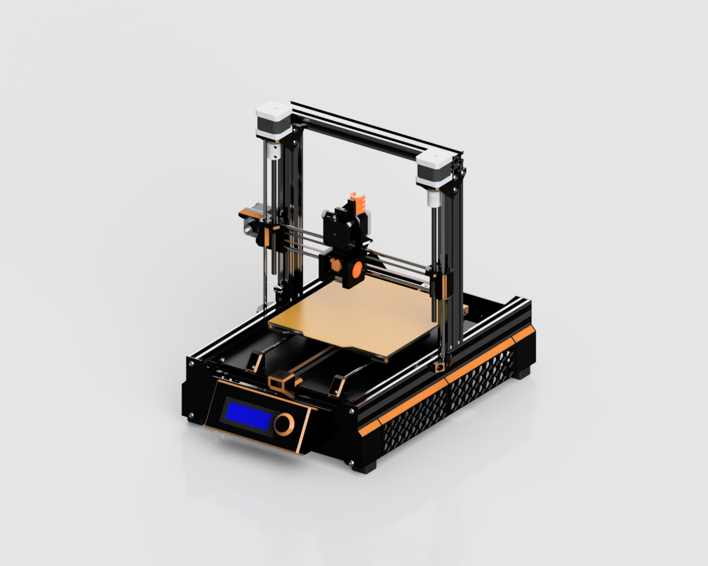

# H317 3D printer

The main idea of this training project is the effective use of parts from past projects

  

## This is some key point:

* **Open-source 3D printer** 
* **RepRap Mix of Prusa, Ender, Voron, RatRig styles**
* **Originally started from RepRap Huxley, but with NEMA 17 (instead NEMA 14) motors**
* **Aliexpress influensed**

## This is some key features:
* **Build volume: 200mm x 200mm x 150mm**
* **E3D V6 style Hot-End**
* **E3D Titan style  Direct Extruder**
* **5 x NEMA 17 Motors**
* **Classic TR8 Lead Screw**
* **6mm x 300mm Linear Rods**
* **LM6UU/SC6UU Linear Bearings**
